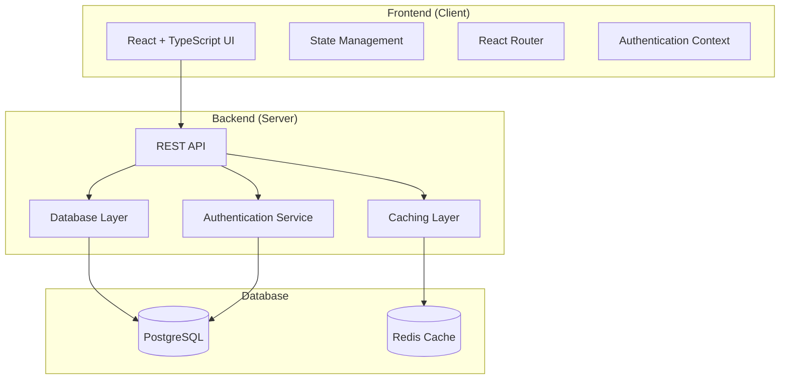

# Error Database - Architecture Overview

## System Architecture

The error database follows a modern full-stack architecture with clear separation between frontend and backend components.

## Component Architecture

### Frontend Components
- **Layout Components**: Header, Footer, Navigation
- **Authentication Components**: Login, Register, Profile
- **Search Components**: SearchBar, Filters, Results
- **Error Components**: ErrorCard, ErrorDetail, SolutionList
- **Contribution Components**: SolutionForm, VoteButtons
- **Category Components**: CategoryBrowser, CategoryFilter

### Backend Services
- **Authentication Service**: User registration, login, JWT management
- **Error Service**: Error code CRUD operations, search functionality
- **Solution Service**: Solution management, voting system
- **Category Service**: Category management and organization
- **Search Service**: Full-text search and filtering

## Data Flow

1. **User Request**: Client makes API request through React components
2. **API Gateway**: Express.js routes handle incoming requests
3. **Service Layer**: Business logic processes the request
4. **Data Access**: Database operations through ORM/query builder
5. **Response**: Structured JSON response sent to client
6. **State Update**: Frontend updates UI based on response

## Scalability Considerations

- **Horizontal Scaling**: Stateless API servers can be scaled horizontally
- **Caching**: Redis for session storage and frequent queries
- **Database Indexing**: Proper indexing for search performance
- **CDN**: Static assets served through CDN for global performance
- **Load Balancing**: Multiple API instances behind load balancer

## Security Architecture

- **Authentication**: JWT-based authentication with refresh tokens
- **Authorization**: Role-based access control (RBAC)
- **Input Validation**: Comprehensive validation on both client and server
- **Rate Limiting**: Protection against abuse and DDoS attacks
- **HTTPS**: All communications encrypted in transit
- **CORS**: Proper cross-origin resource sharing configuration