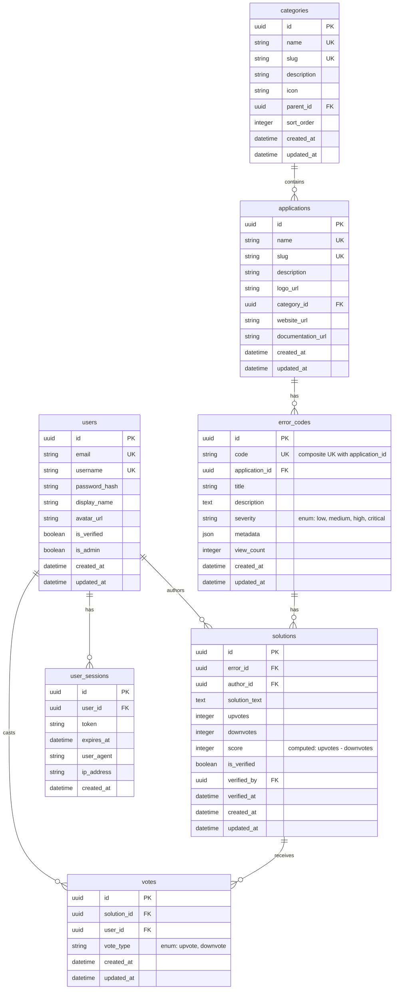

# Error Database - Database Schema Design

## Database Choice: PostgreSQL

We're using PostgreSQL for its reliability, JSON support, and excellent performance with relational data.

## Schema Overview



## Detailed Table Definitions

### Users Table
Stores user account information and authentication details.

```sql
CREATE TABLE users (
    id UUID PRIMARY KEY DEFAULT gen_random_uuid(),
    email VARCHAR(255) UNIQUE NOT NULL,
    username VARCHAR(50) UNIQUE NOT NULL,
    password_hash VARCHAR(255) NOT NULL,
    display_name VARCHAR(100),
    avatar_url VARCHAR(255),
    is_verified BOOLEAN DEFAULT FALSE,
    is_admin BOOLEAN DEFAULT FALSE,
    created_at TIMESTAMP WITH TIME ZONE DEFAULT CURRENT_TIMESTAMP,
    updated_at TIMESTAMP WITH TIME ZONE DEFAULT CURRENT_TIMESTAMP
);
```

### Categories Table
Organizes applications into hierarchical categories.

```sql
CREATE TABLE categories (
    id UUID PRIMARY KEY DEFAULT gen_random_uuid(),
    name VARCHAR(100) UNIQUE NOT NULL,
    slug VARCHAR(100) UNIQUE NOT NULL,
    description TEXT,
    icon VARCHAR(50),
    parent_id UUID REFERENCES categories(id),
    sort_order INTEGER DEFAULT 0,
    created_at TIMESTAMP WITH TIME ZONE DEFAULT CURRENT_TIMESTAMP,
    updated_at TIMESTAMP WITH TIME ZONE DEFAULT CURRENT_TIMESTAMP
);
```

### Applications Table
Represents software applications that generate error codes.

```sql
CREATE TABLE applications (
    id UUID PRIMARY KEY DEFAULT gen_random_uuid(),
    name VARCHAR(100) UNIQUE NOT NULL,
    slug VARCHAR(100) UNIQUE NOT NULL,
    description TEXT,
    logo_url VARCHAR(255),
    category_id UUID REFERENCES categories(id),
    website_url VARCHAR(255),
    documentation_url VARCHAR(255),
    created_at TIMESTAMP WITH TIME ZONE DEFAULT CURRENT_TIMESTAMP,
    updated_at TIMESTAMP WITH TIME ZONE DEFAULT CURRENT_TIMESTAMP
);
```

### Error Codes Table
Stores error codes with their metadata and descriptions.

```sql
CREATE TABLE error_codes (
    id UUID PRIMARY KEY DEFAULT gen_random_uuid(),
    code VARCHAR(50) NOT NULL,
    application_id UUID REFERENCES applications(id) NOT NULL,
    title VARCHAR(255) NOT NULL,
    description TEXT,
    severity VARCHAR(20) CHECK (severity IN ('low', 'medium', 'high', 'critical')),
    metadata JSONB,
    view_count INTEGER DEFAULT 0,
    created_at TIMESTAMP WITH TIME ZONE DEFAULT CURRENT_TIMESTAMP,
    updated_at TIMESTAMP WITH TIME ZONE DEFAULT CURRENT_TIMESTAMP,
    UNIQUE(code, application_id)
);
```

### Solutions Table
Contains user-contributed solutions for error codes.

```sql
CREATE TABLE solutions (
    id UUID PRIMARY KEY DEFAULT gen_random_uuid(),
    error_id UUID REFERENCES error_codes(id) NOT NULL,
    author_id UUID REFERENCES users(id) NOT NULL,
    solution_text TEXT NOT NULL,
    upvotes INTEGER DEFAULT 0,
    downvotes INTEGER DEFAULT 0,
    score INTEGER GENERATED ALWAYS AS (upvotes - downvotes) STORED,
    is_verified BOOLEAN DEFAULT FALSE,
    verified_by UUID REFERENCES users(id),
    verified_at TIMESTAMP WITH TIME ZONE,
    created_at TIMESTAMP WITH TIME ZONE DEFAULT CURRENT_TIMESTAMP,
    updated_at TIMESTAMP WITH TIME ZONE DEFAULT CURRENT_TIMESTAMP
);
```

### Votes Table
Tracks user votes on solutions to prevent duplicate voting.

```sql
CREATE TABLE votes (
    id UUID PRIMARY KEY DEFAULT gen_random_uuid(),
    solution_id UUID REFERENCES solutions(id) NOT NULL,
    user_id UUID REFERENCES users(id) NOT NULL,
    vote_type VARCHAR(10) CHECK (vote_type IN ('upvote', 'downvote')),
    created_at TIMESTAMP WITH TIME ZONE DEFAULT CURRENT_TIMESTAMP,
    updated_at TIMESTAMP WITH TIME ZONE DEFAULT CURRENT_TIMESTAMP,
    UNIQUE(solution_id, user_id)
);
```

### User Sessions Table
Manages user authentication sessions.

```sql
CREATE TABLE user_sessions (
    id UUID PRIMARY KEY DEFAULT gen_random_uuid(),
    user_id UUID REFERENCES users(id) NOT NULL,
    token VARCHAR(255) NOT NULL,
    expires_at TIMESTAMP WITH TIME ZONE NOT NULL,
    user_agent TEXT,
    ip_address VARCHAR(45),
    created_at TIMESTAMP WITH TIME ZONE DEFAULT CURRENT_TIMESTAMP
);
```

## Indexes for Performance

```sql
-- Users table indexes
CREATE INDEX idx_users_email ON users(email);
CREATE INDEX idx_users_username ON users(username);

-- Categories table indexes
CREATE INDEX idx_categories_slug ON categories(slug);
CREATE INDEX idx_categories_parent_id ON categories(parent_id);

-- Applications table indexes
CREATE INDEX idx_applications_slug ON applications(slug);
CREATE INDEX idx_applications_category_id ON applications(category_id);

-- Error codes table indexes
CREATE INDEX idx_error_codes_code ON error_codes(code);
CREATE INDEX idx_error_codes_application_id ON error_codes(application_id);
CREATE INDEX idx_error_codes_severity ON error_codes(severity);
CREATE INDEX idx_error_codes_created_at ON error_codes(created_at);

-- Solutions table indexes
CREATE INDEX idx_solutions_error_id ON solutions(error_id);
CREATE INDEX idx_solutions_author_id ON solutions(author_id);
CREATE INDEX idx_solutions_score ON solutions(score);
CREATE INDEX idx_solutions_is_verified ON solutions(is_verified);

-- Votes table indexes
CREATE INDEX idx_votes_solution_id ON votes(solution_id);
CREATE INDEX idx_votes_user_id ON votes(user_id);

-- User sessions table indexes
CREATE INDEX idx_user_sessions_token ON user_sessions(token);
CREATE INDEX idx_user_sessions_user_id ON user_sessions(user_id);
CREATE INDEX idx_user_sessions_expires_at ON user_sessions(expires_at);
```

## Database Migrations

We'll use Prisma for database migrations:

```bash
# Initialize Prisma
npx prisma init

# Create migration
npx prisma migrate dev --name init

# Generate Prisma client
npx prisma generate
```

## Sample Data

Example category hierarchy:
- Programming Languages
  - JavaScript
  - Python
  - Java
- Web Frameworks
  - React
  - Express.js
  - Django
- Databases
  - PostgreSQL
  - MySQL
  - MongoDB

This schema provides a solid foundation for the error database with proper relationships, indexing, and scalability considerations.